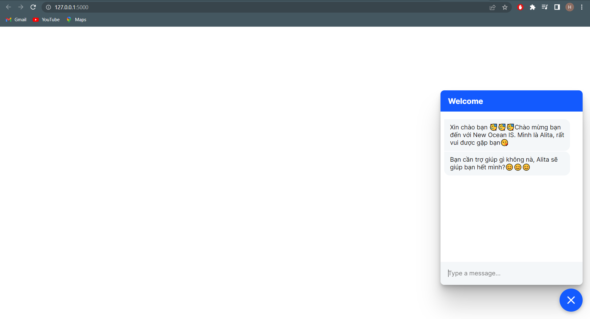

# Xây dựng hệ thống Chatbot bằng Rasa Open Source
Việc xây dựng một AI Chatbot nhằm phục vụ nhu cầu khách hàng cũng như đơn giản hóa việc check-in cho các nhân viên, từ đó giúp hỗ trợ cho việc kiểm soát ra vào trong công ty một cách hiệu quả hơn. Bên cạnh đó Chatbot là phần mềm tin nhắn tự động tích hợp trí tuệ nhân tạo (AI) và xử lý ngôn ngữ tự nhiên (NLP) để hiểu các câu hỏi của khách hàng và tự động hóa phản hồi cho họ, mô phỏng cuộc trò chuyện giữa người với người.
## Description
Thiết kế một giao diện chatbot đơn giản tương tác với người dùng, với model được train thông qua Rasa Open Source. Để tích hợp với nhận diện khuôn mặt và nhận diện giọng nói, bạn cần kết hợp với địa chỉ API của những model đó chứ nó không được tích hợp sẵn trong chatbot.

## Requirement
Để có thể sử dụng source code bạn cần phải cài đặt các thư viện sau với đúng phiên bản:
```bash
Package                 Version
----------------------- ------------
Flask                   2.2.1
jsons                   1.6.3
Keras-Preprocessing     1.1.2
networkx                2.5.1
numpy                   1.18.5
opencv-python           4.6.0.66
PyAudio                 0.2.11
python-crfsuite         0.9.8
python-dateutil         2.8.2
python-engineio         4.3.3
python-socketio         5.7.0
rasa                    2.8.3
rasa-sdk                2.8.6
redis                   3.5.3
regex                   2021.7.6
requests                2.28.1
requests-oauthlib       1.3.1
requests-toolbelt       0.9.1
rfc3986                 1.5.0
rocketchat-API          1.16.0
rsa                     4.8
sounddevice             0.4.4
SpeechRecognition       3.8.1
SQLAlchemy              1.4.39
tensorboard             2.9.1
tensorboard-data-server 0.6.1
tensorboard-plugin-wit  1.8.1
tensorflow              2.3.4
```
## Executing program
Để khởi động server chatbot, bạn cần chạy câu lệnh sau trên terminal:
```bash
rasa run --enable-api --cors "*"
```
Sau khi chạy câu lệnh trên, server sẽ được khởi tạo tạo địa chỉ: http://localhost:5005
Bên cạnh đó bạn cần mở thêm 1 terminal mới để khởi tạo service actions bằng câu lệnh:
```bash
rasa run actions
```
Như vậy chatbot mới có thể kết hợp với các câu lệnh được soạn trong actions.
Sau khi chạy 2 câu lệnh trên 2 terminal khác nhau, ta cần tiếp tục tạo thêm một terminal nữa để khởi tạo web UI cho chatbot. Việc web UI chatbot sẽ được tạo trong thư mục **web ui** nên ta cần di chuyển vào thư mục đó và bắt đầu chạy file **app.py**:
```bash
python app.py
```
Như vậy bạn chỉ cần truy cập địa chỉ http://127.0.0.1:5000/ là sẽ có giao diện trò chuyện với chatbot.
## Authors
* **An Pham** - *Initial work* - [AnHoangbk19](https://github.com/AnHoangbk19)